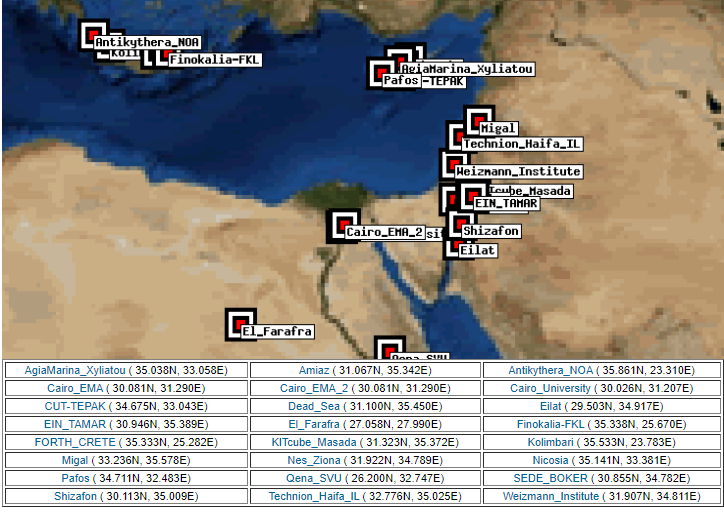
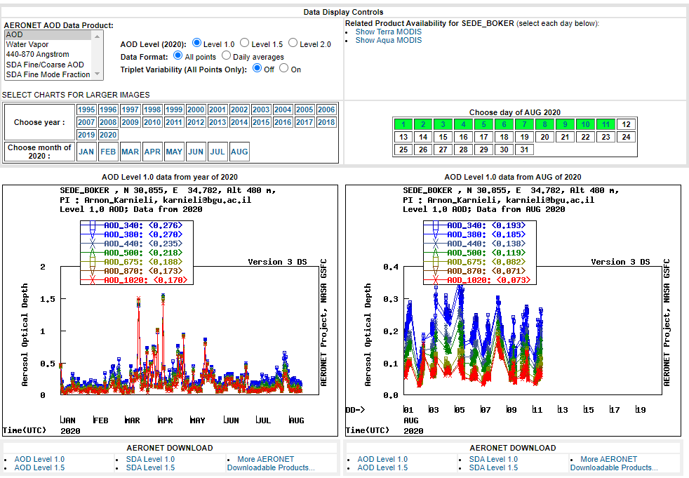

# The `sixs` package

## Purpose

The `sixs` package automates obtaining atmospheric correction parameters by programmatically filling up the [web interface](https://www-loa.univ-lille1.fr/Wsixs/) with user-provided inputs, as well as related functions to aid in atmospheric correction of satellite images in general, and Venus satellite images in particular. 

## Package structure

The main two functions in the package are:

* `sixs_params` for obtaining the 6S parameters
* `toa_rad_to_boa_refl` for convering a TOA radiance image to a BOA reflectance image using the 6S parameters

The package also contains several other functions, :

* `get_venus_metadata` for extracting relevant Venus satellite image metadata from `HDR` files
* `rad_to_refl` for converting TOA radiance to TOA reflectance
* `refl_to_rad` for converting TOA reflectance to TOA radiance

Two datasets are provided to for the reproducible examples (below, and in package docs) to demonstrate atmospheric correction of Venus satellite images:

* `venus1` - a raw (cropped) Venus satellite image (`stars` object), given in TOA reflectance
* `venus1_boa` - an atmospherically-corrected image (`stars` object), given in BOA reflectance
* `venus1m` - raw venus image metadata, the contents of the `HDR` file (`character`)
* `venus2`, `venus2_boa`, `venus2m` - same, for a different Venus image
* `bands` - general information on Venus satellite bands (`data.frame`)
* `venus_validation` - parameters from the metadata and from the 6S website for all 12 bands of both images, for validation purposes

## Setup

### Installing the package

Package `sixs` can be installed from GitHub as follows:

```{r, eval=FALSE}
install.packages("remotes")
remotes::install_github("michaeldorman/sixs")
```

### Setting up a Selenium server

#### Overview

Running the `sixs_params` function, to get the 6S parameters, requires a Selenium server. The server connection needs to be passed as a parameter named `remote_driver` to the `sixs_params` function. 

The recommended way to run a Selenium server is through docker. Detailed instructions on how to do that can be found in the [Docker vignette](https://cran.r-project.org/web/packages/RSelenium/vignettes/docker.html) of package `RSelenium`.

#### Local server

You can start your own local server, for example using the following expression on the command line (Ubuntu 18.04):

```sh
docker run -d -p 4445:4444 selenium/standalone-firefox:2.53.1
```

then connecting to the server from R to create the `remote_driver` object:

```{r, eval=FALSE}
library(RSelenium)
remote_driver = remoteDriver(remoteServerAddr = "localhost", port = 4445L)
remote_driver$open(silent = TRUE)
```

#### Demo server

Alternatively, you can use the demo server we set up for demontrating the package. Here is a small example where we browse to [https://www.google.com](https://www.google.com) and print the page title:

```{r}
library(RSelenium)

# Remote driver
remote_driver = remoteDriver(remoteServerAddr = "164.90.191.95", port = 4445L)

# Open
remote_driver$open(silent = TRUE)

# Browse to google.com & print page title
remote_driver$navigate("https://www.google.com")
remote_driver$getTitle()

# Close
remote_driver$close()
```

Note that the connection needs to be closed at the end using the last expression above. Keeping the connection open consumes RAM and eventually can make the server crash! The demo server is restarted automatically every day at 4AM. If you encounter a problem, please open an [issue](https://github.com/michaeldorman/sixs/issues).

## Example

### Overview

The following sections demonstrate the entire process of going from a raw TOA reflectance Venus satellite image to an atmospherically-corrected BOA reflectance image. 

### Input data

The input data includes:

1. The Venus satellite image fragment (`venus1`)
1. The Venus satellite image metadata (`venus1m`)
1. Venus bands metadata (`bands`)

First, we load the `sixs` package:

```{r}
library(sixs)
```

Here is a printout of the raw Venus image fragment, `venus1`. The object contains the original information from the `.tif` file, cropped to a small spatial extent (to reduce image size) and using only the reflective bands 1-12:

```{r}
venus1
```

and here is a visualization. Note that the image includes six (reflective) bands 1-12:

```{r}
plot(venus1)
```

In case you are working with a real Venus image, rather than the sample dataset, the `.TIF` file can be read into a `stars` object with:

```{r, eval=FALSE}
library(stars)

# Read image
r = read_stars("/home/michael/Dropbox/Packages/sixs/other/venus_sample_data/images/VE_VM01_VSC_PDTIMG_L1VALD_ISRAEL03_20190204.DBL.TIF_crop.TIF", proxy = FALSE)

# Subset bands
r = r[,,,1:12]
```

The Venus image metadata comes as an XML document in an `.HDR` file. File contents are stored as a `character` of length 1 named `venus1m`. Here are the first 80 characters from it:

```{r}
substr(venus1m, 1, 80)
```

Additionally, the `sixs` package includes general metadata about the 12 reflective bands of the Venus satellite, in a `data.frame` named `bands`:

```{r}
bands
```

### Getting image metadata

The first step is to process the `HDR` metadata `character` into a `list` (using the `XML` package), then extract the relevant metadata items to another (smaller) `list` using `get_venus_metadata`:

```{r}
library(XML)
l = xmlToList(venus1m)
m = get_venus_metadata(l, band = 1)
```

Here is the list with metadata items that we now have:

```{r}
m
```

In case you are working with a real Venus image, rather thean the sample dataset, the same result can be obtained reading from the `.HDR` file:

```{r, eval=FALSE}
library(XML)
x = xmlParse("VE_VM01_VSC_L1VALD_ISRAEL03_20190204.HDR")
l = xmlToList(x)
m = get_venus_metadata(l, band = 1)
```

### Reflectance to radiance

Venus satellite images are provided in TOA reflectance values, multiplied by 1000. However, the 6S algorithm requires the input to be TOA radiance values. 

Therefore, to proceed, the Venus image values need to be divided by 1000:

```{r}
venus1 = venus1 * 0.001
```

In the example, we atmospherically correct a specific band (3), therefore we will also subset the third layer from the `venus1` image:

```{r}
venus1 = venus1[,,,3,drop=TRUE]
names(venus1) = "TOA reflectance"
```

Here is what the TOA reflectance values in band 3 of the `venus1` sample image look like:

```{r}
plot(venus1)
```

Now, the TOA reflectance values need to be converted back to TOA radiance values (so that they can be used as input in the 6S algorithm). The conversion from TOA reflectance to TOA radiance can be done using function `refl_to_rad`. 

Here is an example of converting the band 3 of the `venus1` image from TOA reflectance to TOA radiance:

```{r}
m = get_venus_metadata(l, band = 3)
venus1_toa_rad = refl_to_rad(
  toa_refl = venus1,
  date = m$date,
  esun = bands$esun[3],
  solar_zenith_angle = m$solar_zenith_angle
)
names(venus1_toa_rad) = "Band 3, TOA radiance"
```

And here is an image of the result:

```{r}
plot(venus1_toa_rad)
```

(When the satellite image is given in radiance units, the inverse `rad_to_refl` function can be used to convert it to a TOA reflectance image---if necessary. The required data includes the `date`, `esun` and `solar_zenith_angle`, same as in `refl_to_rad`.)

### Atmospheric parameters from Aeronet

In addition to the Venus image metadata extracted from the `.HDR` file and the general information in the `bands` table, the 6S algorithm also requires obtaining three meteorological parameters from the AERONET stations data, namely:

* AOD 550nm
* Uw [g cm-2]
* UO3 [cm/atm]

Here is how to obtain these parameters:

* Navigate to the AERONET [web page](https://aeronet.gsfc.nasa.gov/cgi-bin/draw_map_display_aod_v3) to open the available data from AERONET stations worldwide.

* Choose an AEORONET station that is geographically located near your site. It is possible to click on the map several times in order to zoom in and choose the relevant station easily. For example, the screenshot below shows a list of AERONET stations in the western Middle East (Israel, Egypt, Cyprus and Greece).

```{r fig1, echo=FALSE, fig.cap="Example of a list of AERONET stations"}

```

* Click on the relevant station. This will open a window as shown in the following screenshot.

```{r fig2, echo=FALSE, fig.cap="A window of meteorological data for Sede Boker site in Israel. The links for downloading the relevant data are shown in red squares"}

```

* Choose the relevant period (year) on the left panel. In case the user does not choose the relevant period, the website will return data for the current year as a default. Another option is to choose a specific relevant day on the right panel; however, it this is not useful for atmospheric correction of satellite imagery since these corrections require a daily temporal resolution and not hourly.

* Click on AOD Level 1.0 to download the data. 

* Accept the data usage agreement.

* Download and unzip the data (a `.lev1` file) and open the data in Excel using the option "from text" in the "data" tab.

* Calculate the AOD in 550 nm: use the AOD in 675 nm (AOD_675nm column) and AOD in 500 nm (AOD_500nm column) in the formula below to calculate AOD in 550 nm:

* Find the perceptible water value under the column "Precipitable_Water(cm)" that presents the water vapor (Uw) in [g cm-2].

* Find the Ozone concentration value under the column "Ozone(Dobson)" that presents the O3 concentration in Dobson units. Multiply this value by 0.001 to obtain the Ozone concentration in [cm/atm].

Specifically for the image we are working with in this example, `venus1`, the required parameters are:

```{r}
Uw = 0.665071
Uo3 = 0.2982371
opticalDepth = 0.1105934
```

### Additional parameters

Finally, there are some parameters required for the 6S algorithm that cannot be obtained from the image metadata or from the Aeronet website. Instead, they need to be determined according to the purposes of image correction:

* `GroundCondition` is usually `"Patchy Ground"`.
* `TargetReflectance` depends on what the project focuses on.
* `EnvironmentReflectance` depends on surrounding cover.
* `TargetRadius` needs to be smaller than pixel size, in meters (for Venus <5.3)

 Here are the specific values we are going to use when correcting the `venus1` image:

```{r}
GroundCondition = "Patchy Ground"
TargetReflectance = "Vegetation"
EnvironmentReflectance = "Vegetation" 
TargetRadius = 0.5
```

### 6S parameters

Once we have all of the parameters, the remote server is set and the `remote_driver` object exists, you can execute the `sixs_params` function to get the 6S parameters. 

For example, for band 3 from the `venus1` image we get:

```{r}
remote_driver$open(silent = TRUE)
xcoefficients = sixs_params(
  remote_driver = remote_driver, 
  day = as.numeric(format(m$date, "%d")),
  month = as.numeric(format(m$date, "%m")), 
  SolarZenithalAngle = m$solar_zenith_angle, 
  SolarAzimuthalAngle = m$solar_azimuth_angle,
  ViewZenithalAngle = m$view_zenith_angle,
  ViewAzimuthalAngle = m$view_azimuth_angle, 
  Longitude = m$longitude, 
  Latitude = m$latitude, 
  Uw = 0.665071, 
  Uo3 = 0.2982371, 
  opticalDepth = 0.1105934, 
  LowerWavelength = bands$lower[3], 
  UpperWavelength = bands$upper[3],
  TargetAltitude = m$elevation,
  GroundCondition = "Patchy Ground",
  TargetReflectance = "Vegetation",
  EnvironmentReflectance = "Vegetation", 
  TargetRadius = 0.5
)
remote_driver$close()
```

You can use the `.screenshot=TRUE` parameter in the above function call for viewing the web interface throughout the process. This will create a temporary file named `rselenium_screenshot.png` in the current working directory.

The result is a named numeric vector with the 6S parameter values, valid for band 3 of the `venus1` image:

```{r}
xcoefficients
```

### TOA to BOA

Finally, using the 6S parameters we can convert the TOA radiance image (band 3) to a BOA reflectance image, using function `toa_rad_to_boa_refl`. We are using the `xcoefficients`, which contains the parameters we obtained from the 6S website in the previous step:

```{r}
venus1_boa_refl = toa_rad_to_boa_refl(
  toa_rad = venus1_toa_rad, 
  params = xcoefficients
)
names(venus1_boa_refl) = "Band 3, BOA reflectance"
```

Here is the result, BOA reflectance in band 3 of the Venus image with started with (`venus1`):

```{r}
plot(venus1_boa_refl)
```

### Correcting all 12 bands

The following code section repeats the steps demonstrated above, but executing them sequentially for each of the 12 bands, rather than just for band 3, using a `for` loop:

```{r}
library(sixs)
library(XML)
library(RSelenium)

# Get image metadata
data(venus1m)
l = xmlToList(venus1m)

# Empty list to keep results
result = list()

for(i in 1:12) {

  # Rescale and select band
  data(venus1)
  venus1 = venus1 * 0.001
  venus1 = venus1[,,,i,drop=TRUE]

  # Get image band metadata
  m = get_venus_metadata(l, band = i)

  # Convert TOA reflectance to TOA radiance
  venus1_toa_rad = refl_to_rad(
    toa_refl = venus1,
    date = m$date,
    esun = bands$esun[i],
    solar_zenith_angle = m$solar_zenith_angle
  )

  # Get 6S parameters
  remote_driver = remoteDriver(remoteServerAddr = "164.90.191.95", port = 4445L)
  remote_driver$open(silent = TRUE)
  xcoefficients = sixs_params(
    remote_driver = remote_driver, 
    day = as.numeric(format(m$date, "%d")),
    month = as.numeric(format(m$date, "%m")), 
    SolarZenithalAngle = m$solar_zenith_angle, 
    SolarAzimuthalAngle = m$solar_azimuth_angle,
    ViewZenithalAngle = m$view_zenith_angle,
    ViewAzimuthalAngle = m$view_azimuth_angle, 
    Longitude = m$longitude, 
    Latitude = m$latitude, 
    Uw = 0.665071, 
    Uo3 = 0.2982371, 
    opticalDepth = 0.1105934, 
    LowerWavelength = bands$lower[i], 
    UpperWavelength = bands$upper[i],
    TargetAltitude = m$elevation,
    GroundCondition = "Patchy Ground",
    TargetReflectance = "Vegetation",
    EnvironmentReflectance = "Vegetation", 
    TargetRadius = 0.5,
    quiet = TRUE
  )
  remote_driver$close()

  # Convert TOA radiance to BOA rteflectance
  venus1_boa_refl = toa_rad_to_boa_refl(venus1_toa_rad, xcoefficients)

  # Add result to list
  result[[i]] = venus1_boa_refl

}

# Combine to multi-band raster
result$along = 3
result = do.call(c, result)
```

The image `result` is the final corrected image, now with all of the 12 bands (rather than just band 3):

```{r}
plot(result)
```

And here is an example of two reflectance profiles for a particular pixel (80,80) in the image. The original TOA reflectance profile is shown in red. The corrected BOA reflectance profile is shown in blue:

```{r}
# Extract reflectance profiles for one pixel
data(venus1)
toa_refl1 = venus1[[1]][80,80,] * 0.001
boa_refl1 = result[[1]][80,80,]

# Plot profiles
plot(
  x = rowMeans(bands[c("lower", "upper")]), y = toa_refl1, 
  type = "b", 
  xlab = "Wavelength (micrometers)", 
  ylab = "Reflectance", 
  ylim = range(c(toa_refl1, boa_refl1)),
  col = "red"
)
lines(
  x = rowMeans(bands[c("lower", "upper")]), 
  y = boa_refl1, 
  type = "b", 
  col = "blue"
)
legend(
  "bottomright",
  lty = c(1, 1),
  legend = c("TOA reflectance (original image)", "BOA reflectance (corrected)"), 
  col = c("red", "blue")
)
```

Done!
